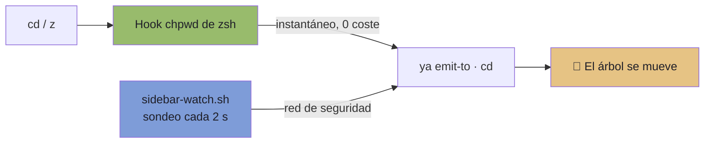

<div align="center">

# Álvaro´s Dotfiles

### 🖥️ Entorno de terminal y agentes en macOS

Un flujo de trabajo completo sin salir de la terminal: **tmux**, **yazi** y **Ghostty**,
más la configuración de **Claude Code** y **OpenCode**.<br/>
Cada pieza está documentada, y toda la lógica propia está cubierta por tests.

<br/>


<br/>

**[⚡ Instalación](#-instalación)** ·
**[🗺️ Mapa](#️-mapa-del-repositorio)** ·
**[📊 Barra de estado](#-barra-de-estado)** ·
**[📂 Barra lateral](#-barra-lateral-de-archivos)** ·
**[🤖 Agentes](#-agentes)** ·
**[🔐 Secretos](#-secretos)** ·
**[🧪 Tests](#-tests)**

</div>

---

## 🎯 En una pantalla

```
┌────────────────────────────────────────────────────────────────────────────┐
│ [FILES] main 1:zsh            CPU 18%  GPU 6%  RAM 9.1/16.0G  16:22  11 Aug│
├──────────────────────┬─────────────────────────────────────────────────────┤
│ ~/Proyectos/gdr      │ ~/Proyectos/gdr  on main                            │
│  .agents             │ >                                                   │
│  .github             │                                                     │
│  src                 │         El árbol sigue tu directorio.               │
│  .env                │         Cambias con cd o z, y se mueve solo.        │
│  package.json        │                                                     │
└──────────────────────┴─────────────────────────────────────────────────────┘
   ↑ Alt+t lo abre y cierra          ↑ Enter abre el archivo en pestaña nueva
```

| Quiero… | Pulso |
| :--- | :--- |
| 📂 Abrir o cerrar el árbol | `Alt+t` · `prefix`+`e` · clic en **`[FILES]`** |
| 📄 Abrir un archivo | `Enter` sobre él (se abre en pestaña nueva) |
| ❌ Cerrar ese archivo | `Ctrl+X` · `Alt+w` · `prefix`+`k` |
| 🪟 Panel scratch flotante | `Alt+g` |
| ↔️ Moverme entre splits | `Cmd+Alt+H/J/K/L` · `Cmd+[` · `Cmd+]` |

---

## ⚡ Instalación

```bash
git clone git@github.com:alvaroofernaandez/dotfiles.git ~/dotfiles
cd ~/dotfiles

./install.sh --dry-run   # 👀 muestra qué haría, sin tocar nada
./install.sh             # 🔗 enlaza de verdad
```

> [!IMPORTANT]
> **`install.sh` nunca borra nada.** Si ya tienes configuración en el destino, la mueve a
> `~/.dotfiles-backup/<timestamp>/` antes de enlazar. Volver a ejecutarlo es seguro: los
> enlaces que ya apuntan aquí se dejan intactos.

<details>
<summary><b>¿Por qué los backups van a un directorio aparte y no junto al original?</b></summary>

<br/>

Porque las herramientas escanean sus carpetas de configuración **enteras**. Un
`ship.bak.20260811` dentro de `~/.claude/skills` se cargaría como una **segunda skill
duplicada**, y de hecho pasó: aparecieron cuatro skills fantasma en la sesión.

Los backups viven fuera de cualquier árbol escaneado, y hay un test que lo verifica.

</details>

### 🔗 Qué enlaza

| Origen en el repo | Destino | Función |
| :--- | :--- | :--- |
| `config/tmux` | `~/.config/tmux` | Scripts del sidebar y la barra de estado |
| `config/yazi` | `~/.config/yazi` | Gestor de archivos, uso general |
| `config/yazi-sidebar` | `~/.config/yazi-sidebar` | Variante estrecha para el panel lateral |
| `config/ghostty` | `~/.config/ghostty` | Terminal: tema, tipografía, arranque |
| `home/*` | `~/.tmux.conf`, `~/.zshrc`, `~/.zprofile`, `~/.gitconfig`, `~/.p10k.zsh` | Configuración de shell y git |
| `config/atuin`, `gh`, `git` | `~/.config/...` | Herramientas con fichero propio |
| `shared/skills` | 3 destinos a la vez | Skills propias, compartidas entre agentes |
| `config/claude/*` | `~/.claude/*` | Claude Code, **ruta por ruta** |
| `config/opencode/*` | `~/.config/opencode/*` | OpenCode, **ruta por ruta** |

> [!WARNING]
> **Los directorios de agentes se enlazan ruta por ruta, nunca completos.**
> `~/.claude` contiene además `.credentials.json` y **1,6 GB** de historial de sesiones;
> `~/.config/opencode` contiene `node_modules`. Enlazar el directorio entero desplazaría
> todo eso. Hay tests que verifican que `~/.claude` sigue siendo un directorio real y que
> las credenciales sobreviven a la instalación.

### 🚀 Arranque

Ghostty ejecuta `config/ghostty/launch.sh`, que resuelve tmux **por ruta absoluta** y
adjunta cada pestaña a **una sesión propia** (reutilizando una libre si la hay). Si tmux
no estuviera, cae a una shell de login: un multiplexor ausente no puede dejarte sin
terminal.

<details>
<summary><b>¿Por qué rutas absolutas en todas partes?</b> (la lección que más veces mordió)</summary>

<br/>

Ghostty lanza su comando así:

```bash
/usr/bin/login -flp <usuario> /bin/bash --noprofile --norc -c <comando>
```

`--noprofile --norc` significa que **no se lee ningún rc de shell**, y una aplicación
lanzada desde el Dock hereda el `PATH` de **launchd**:

```
/usr/bin:/bin:/usr/sbin:/sbin
```

Ahí no está `/opt/homebrew/bin` ni `~/.nix-profile/bin`. Esto rompió el entorno **tres
veces seguidas**, cada vez con un síntoma distinto:

| Dónde faltaba la ruta absoluta | Cómo se manifestó |
| :--- | :--- |
| `command` de Ghostty | `exec: tmux: not found` — sin terminal |
| `tmux` dentro de los scripts | `returned 127` — la tecla no hacía nada |
| Comando pasado a `split-window` | El panel parpadeaba y moría |

Un panel muerto se cierra **en silencio**: nunca aparece un error. Y ejecutar el script
desde una shell interactiva funcionaba, porque ahí el `PATH` viene heredado — la
comprobación pasaba mientras el uso real fallaba.

Los tests ahora ejecutan bajo `env -i PATH="/usr/bin:/bin:/usr/sbin:/sbin"`, el entorno
real de producción.

</details>

<details>
<summary><b>¿Por qué <code>allow-passthrough on</code> en tmux?</b></summary>

<br/>

yazi envía sondas `DA1`/`DSR` al arrancar para detectar las capacidades del terminal. Sin
passthrough, tmux las bloquea, yazi espera a agotar su tiempo y muestra
**«Terminal response timeout»** sobre el panel durante varios segundos antes de dibujar
nada.

</details>

### 📦 Dependencias

```bash
brew install tmux yazi neovim bat fd ripgrep sd eza gitleaks
```

---

## 🗺️ Mapa del repositorio

```
dotfiles/
│
├── 📁 shared/skills/          Skills propias, independientes de la herramienta
│
├── 📁 config/
│   ├── 🖥️  ghostty/            Tema Tokyo Night, tipografía, arranque
│   │   └── launch.sh          Resuelve tmux y se adjunta a la sesión
│   │
│   ├── 🪟 tmux/
│   │   ├── sidebar-toggle.sh  Abre y cierra el panel lateral
│   │   ├── sidebar-follow.sh  Mueve el árbol al hacer cd (vía hook de zsh)
│   │   ├── sidebar-watch.sh   Red de seguridad: sincroniza sin depender del shell
│   │   ├── open-file.sh       Abre el archivo en una pestaña nueva
│   │   ├── close-file.sh      La cierra sin escribir el comando del editor
│   │   ├── statusbar.sh       CPU · GPU · RAM · hora · fecha
│   │   └── tests/             8 suites
│   │
│   ├── 📂 yazi/               Config de uso general
│   ├── 📂 yazi-sidebar/       Config exclusiva del panel (árbol puro)
│   ├── 🤖 claude/             CLAUDE.md, settings, agentes, comandos, hooks
│   ├── 🤖 opencode/           opencode.json, AGENTS.md, agentes, plugins
│   └── 🔧 atuin, gh, git/     Herramientas con fichero de configuración propio
│
├── 📁 home/                   tmux.conf, zshrc, zprofile, gitconfig, p10k.zsh
├── ⚙️  install.sh              Enlaza con backup, nunca borra
└── 🧪 tests/                  7 suites transversales
```

---

## 📊 Barra de estado

Fila superior, cada dato en su propio bloque de color:

```
 [FILES] main 1:zsh        CPU 18%   GPU 6%   RAM 9.1/16.0G   16:22   11 Aug
```

| Segmento | Color Kanagawa | De dónde sale el dato | Coste |
| :--- | :--- | :--- | ---: |
| 🔵 **CPU** | crystalBlue | `sysctl vm.loadavg` ÷ núcleos | 6 ms |
| 🟣 **GPU** | oniViolet | `ioreg -c AGXAccelerator` → `Device Utilization %` | 16 ms |
| 🟢 **RAM** | springGreen | `vm_stat`: active + wired + compressed | 6 ms |
| 🟡 **Hora** | carpYellow | `date` | ~0 |
| 🌸 **Fecha** | sakuraPink | `date` | ~0 |

**Total: ~32 ms por refresco.** Hay un test que falla si supera los 100 ms.

<details>
<summary><b>🔥 La historia: la barra costaba 5,3 segundos por refresco</b></summary>

<br/>

Al medir el consumo, esto es lo que estaba pasando **cada 5 segundos**:

| Script | Coste |
| :--- | ---: |
| `cpu_info.sh` (tema kanagawa) | **5064 ms** |
| `metrics.sh` (propio) | 226 ms |
| `ram_info.sh` (tema kanagawa) | 39 ms |
| **Total** | **~5329 ms** |

El script de CPU de kanagawa contiene un `sleep` para muestrear un delta de CPU: tardaba
**más que el propio intervalo de refresco**. La barra nunca terminaba antes de que
arrancara el siguiente ciclo. Aproximadamente **un core al 100 % de forma permanente**
para dibujar una línea de texto. Y encima duplicado: kanagawa y el script propio
calculaban lo mismo.

**Decisiones que lo arreglaron:**

- ❌ Fuera los plugins `cpu-usage` y `ram-usage` del tema.
- ❌ Fuera `top -l 1` (208 ms: recorre toda la tabla de procesos).
- ❌ Fuera el arranque de un intérprete de Python (29 ms) solo para dividir números.
- ✅ La CPU sale del **load average**, no de utilización muestreada: muestrear exige dos
  lecturas separadas por un `sleep`, que es exactamente lo que costaba segundos.
- ✅ GPU por `ioreg`, porque `powermetrics` **exige superusuario** y no puede ejecutarse
  desde un hook de estado.

</details>

<details>
<summary><b>🎨 Reglas de diseño de la barra</b></summary>

<br/>

- **El color identifica la métrica, nunca es el único portador de información.** Cada
  bloque lleva su etiqueta y su valor, así que funciona en monocromo, en capturas y con
  daltonismo.
- **Contraste verificado numéricamente**, no a ojo: todos los bloques superan 4,5:1
  (el más bajo, oniViolet, en 5,6:1).
- **Umbral en rojo solo para valores.** Un dato por encima del 85 % pasa a `autumnRed`.
  El color de alerta se reserva para lo que de verdad es una alerta, nunca para adornar.
- **Sin glifos de Nerd Font.** Solo ASCII, así que la fila no se rompe en un terminal sin
  tipografía parcheada.
- **Sin fondo propio.** `status-style bg=default` hereda el del terminal, así que la
  transparencia y el desenfoque de Ghostty se mantienen. Los bloques son la única
  superficie pintada.
- **`LC_ALL=C` fijado.** Bajo un locale español, `awk` formatea decimales con coma
  (`8,5/16,0G`) y `date` produce meses de ancho variable (`ago.` / `sept.`), así que la
  barra cambiaba según el entorno que hubiera arrancado el servidor de tmux.

Las reglas completas están en `.agents/DESIGN.md`, que se mantiene en local.

</details>

---

## 📂 Barra lateral de archivos

Un panel de **yazi** al 30 % a la izquierda, que hereda el directorio de la ventana.

| Acción | Atajo |
| :--- | :--- |
| Abrir / cerrar | `Alt+t` · `prefix`+`e` · clic en **`[FILES]`** |
| Abrir archivo | `Enter` |
| Cerrar archivo | `Ctrl+X` · `Alt+w` · `prefix`+`k` |

### 🪟 Cada pestaña, su propio proyecto

Cada pestaña de Ghostty abre **su propia sesión de tmux**, así que puedes trabajar en dos
proyectos en paralelo sin que se interfieran: cada una con su sidebar, su directorio y su
historial.

> [!NOTE]
> Si al arrancar hay una sesión **sin ningún cliente adjunto**, se reutiliza. Eso es lo que
> hace que cerrar una pestaña no pierda su trabajo: al abrir otra, la recuperas. Solo se
> crea una sesión nueva cuando todas están en uso.

<details>
<summary><b>El bug que llevó a esto: dos pestañas eran la misma</b></summary>

<br/>

El arranque hacía `tmux new-session -A -s main`, y ese `-A` significa «adjúntate si ya
existe». Cada pestaña de Ghostty es un **cliente** distinto de tmux, pero las dos se
adjuntaban a la misma sesión y **dibujaban la misma ventana**:

```
sesión main: 1 ventana, 2 clientes adjuntos
  /dev/ttys003 → main     ← pestaña 1
  /dev/ttys006 → main     ← pestaña 2
```

Un `z japan-2027` en una movía el árbol de la otra. No eran dos entornos: era uno
renderizado dos veces. La pista estaba en la propia barra: `main 1:zsh*` idéntico en
ambas.

</details>

### 🔄 El árbol sigue tu directorio

Cambias de carpeta con `cd` o `z` y el árbol se mueve contigo. **Dos mecanismos**, a
propósito:



| Mecanismo | Latencia | Coste | Cubre |
| :--- | :--- | :--- | :--- |
| Hook `chpwd` de zsh | Instantánea | 0 | Shells abiertos **después** de instalarlo |
| `sidebar-watch.sh` | ≤ 2 s | ~0,65 % de un core | **Todo lo demás** |

> [!NOTE]
> El vigilante existe porque los hooks de zsh **se registran al arrancar el shell**. Un
> shell abierto antes de instalar el hook no lo tiene, y dejaría de sincronizar en
> silencio. El vigilante solo vive mientras vive el sidebar: comprueba en cada ciclo y
> muere en cuanto el panel, la marca o el servidor de tmux desaparecen.

### 📄 Abrir archivos

Al pulsar `Enter`, el archivo se abre en una **ventana nueva de tmux** con **nano**.

<details>
<summary><b>¿Por qué una ventana nueva y no el panel de trabajo?</b></summary>

<br/>

Porque lo que tengas corriendo donde estabas —un build, un REPL, un editor con cambios
sin guardar— **no se toca**: no recibe pulsaciones ni pierde el foco. Al cerrar el editor,
la ventana desaparece y vuelves exactamente donde estabas.

El diseño anterior escribía en el panel de trabajo con `send-keys` y necesitaba decidir
entre tres ramas: escribir en el shell, reusar nvim con `:edit`, o negarse si el panel
estaba ocupado. Toda esa complejidad existía **solo** porque escribía en un panel que
podías estar usando. Una ventana nueva hace la pregunta irrelevante.

</details>

<details>
<summary><b>¿Por qué nano y no <code>$EDITOR</code>?</b></summary>

<br/>

Porque el requisito era **cerrar con `Ctrl+X`**, que es literalmente la tecla de salida de
nano. No hay atajo inventado por medio: es el propio editor. Y si el archivo tiene cambios
sin guardar, nano pregunta *«Save modified buffer?»* — la protección viene incluida.

`$EDITOR` es `nvim` en este sistema, que necesita `:q`. Se puede cambiar con `FILE_EDITOR`.

> ⚠️ **Detalle de macOS:** `/usr/bin/nano` es la build **PICO** de Apple, y tmux reporta
> el proceso como `pico`, no `nano`. `close-file.sh` acepta ambos nombres; si solo
> contemplara `nano`, `Alt+w` mataría el editor sin preguntar por los cambios.

</details>

<details>
<summary><b>Cómo se cierra un archivo sin perder trabajo</b></summary>

<br/>

Dos reglas hacen esto seguro:

1. **Solo cierra lo que abrió el sidebar.** `open-file.sh` marca su ventana con
   `@file_window`; `close-file.sh` se niega con cualquier otra y te lo dice. Deducirlo por
   el nombre de la ventana o por lo que corre dentro habría acabado cerrando trabajo real.
2. **Al editor le pide salir, no lo mata.** Con nano envía `Ctrl+X`; con vim/nvim, `:q`.
   Si hay cambios sin guardar, el editor se niega y avisa. Descartar trabajo no guardado
   nunca es decisión del atajo.

</details>

<details>
<summary><b>¿Por qué el árbol no muestra previsualización?</b></summary>

<br/>

La configuración del panel usa `ratio = [0, 1, 0]`: sin columna padre y sin preview.

A 60 columnas, el diseño de tres columnas por defecto de yazi trunca **todos** los
nombres (`documentacion-tecnica-del….md`). Aquí el ancho completo va al árbol, y la
previsualización la da el panel de trabajo al abrir el archivo.

`YAZI_CONFIG_HOME` **reemplaza** a `~/.config/yazi`, no se fusiona con ella, así que el
`opener` está duplicado a propósito — y un test falla si las dos copias divergen.

</details>

### ⚙️ Ajustes

| Variable | Por defecto | Para qué |
| :--- | :--- | :--- |
| `SIDEBAR_CMD` | `yazi` | Programa que corre en el panel |
| `SIDEBAR_WIDTH` | `30%` | Ancho del panel |
| `SIDEBAR_CONFIG_HOME` | `~/.config/yazi-sidebar` | Config de yazi propia del panel |
| `FILE_EDITOR` | `nano` | Editor al abrir un archivo |
| `WATCH_INTERVAL` | `2` | Segundos entre comprobaciones del vigilante |

### ⌨️ Por qué estos atajos y no otros

> [!CAUTION]
> **En una distribución «Spanish - ISO», `Option+E` es la tecla muerta del acento agudo.**
> macOS la consume para componer `á`/`é` y **nunca llega a tmux**.

El atajo original era `Alt+e` («explorer») y parecía no hacer nada: el binding estaba
registrado y el script funcionaba, pero la pulsación no llegaba. Regla del proyecto:
**nunca atar `Option` + `e` / `i` / `u` / `n`.**

Por eso hay tres accesos: `Alt+t` (una pulsación, sin colisión), `prefix`+`e` (no pasa por
`Option`) y el botón **`[FILES]`** (no depende del teclado en absoluto).

---

## ⌨️ Moverse entre splits

Los paneles de una ventana de Ghostty son **splits suyos**, cada uno con su propia sesión
de tmux. Moverse entre ellos es cosa de Ghostty: tmux nunca ve esas teclas.

| Atajo | Acción |
| :--- | :--- |
| `Cmd+Alt+H` `J` `K` `L` | Salto direccional, sin soltar la fila home |
| `Cmd+Alt+←` `↓` `↑` `→` | Lo mismo con flechas |
| `Cmd+[` · `Cmd+]` | Recorrer los splits en orden |

Con ocho abiertos, el ciclado llega a cualquiera sin pensar en la distribución; el salto
direccional sirve cuando ya sabes dónde está.

> [!NOTE]
> **Ghostty no permite «ir al split N».** `goto_split` solo acepta direcciones y
> `previous`/`next` — comprobado contra el binario: `goto_split:1` devuelve
> `error.InvalidFormat`. Por eso no hay un equivalente a `Cmd+1`…`Cmd+8` como el de las
> pestañas.

<details>
<summary><b>Por qué estas teclas y no otras</b></summary>

<br/>

- **`Ctrl+H/J/K/L` queda libre a propósito.** Ghostty recibe las teclas **antes** que
  tmux, así que atarlas ahí dejaría inservible `vim-tmux-navigator` dentro de cada sesión.
- **`Cmd+H`, `Cmd+M` y `Cmd+Q` no se tocan.** macOS los usa para ocultar, minimizar y
  salir; capturarlos dentro del terminal te los quita en toda la ventana.
- Las flechas se conservan como alias de las letras: misma acción, sin reaprender nada.

</details>

---

## 🤖 Agentes

### 🧩 Skills compartidas

`shared/skills` contiene **solo skills propias**. Son independientes de la herramienta y
se enlazan a los tres destinos a la vez, así que existen una sola vez.

| Skill | Función |
| :--- | :--- |
| 📄 `example-org-pdf-report` | Informes y propuestas en PDF A4 con marca |
| 🏗️ `example-org-repo-prep` | Deja un repositorio con descripción, topics y README de la casa |
| 🎬 `example-org-video-demo` | Vídeos de demo de producto de 60–90 s |
| 🚢 `ship` | De árbol de trabajo a PR publicada |

Las skills de marketplaces y packs de terceros **no se versionan**: cada herramienta las
reinstala por su cuenta.

<details>
<summary><b>La duplicación ya había divergido</b></summary>

<br/>

Cuando las skills estaban duplicadas entre Claude y OpenCode, dos copias de la misma
skill medían el presupuesto de PR con reglas distintas:

```diff
- opencode:  "PRs over 400 changed lines"
+ claude:    "PRs over 400 production lines"  + "Test files never count"
```

El concepto se refinó en un lado y el otro se quedó atrás. Ese es exactamente el fallo que
una fuente única elimina.

</details>

<details>
<summary><b>Lo que NO se comparte, y por qué</b></summary>

<br/>

Los `commands/` y `agents/` son específicos de cada herramienta. No es duplicación
accidental:

```yaml
# config/claude/commands/sdd-apply.md    # config/opencode/commands/sdd-apply.md
---                                      ---
description: Implement SDD tasks         description: Implement SDD tasks
---                                      agent: gentle-orchestrator
                                         subtask: true
                                         ---
```

`agent:` y `subtask:` son sintaxis propia de OpenCode, y las rutas apuntan a sitios
distintos. Son la **capa de adaptación** entre cada herramienta y las skills compartidas.

</details>

### 📋 Configuración por herramienta

| Ruta | Contenido |
| :--- | :--- |
| `claude/CLAUDE.md` | Instrucciones globales: persona, TDD estricto, pipeline de diseño |
| `claude/sdd-orchestrator.md` | Reglas de orquestación y delegación para SDD |
| `claude/settings.json` | Permisos, hooks, plugins y marketplaces |
| `claude/agents/`, `commands/`, `hooks/`, `prompts/` | Subagentes, comandos y hooks |
| `opencode/opencode.json`, `AGENTS.md` | Configuración e instrucciones globales |
| `opencode/agents/`, `plugin/`, `profiles/` | Adaptadores y extensiones |

---

## 🐚 Shell y herramientas

> [!TIP]
> **`bat`, `zoxide`, `fzf` y `eza` no tienen fichero de configuración propio.** Todo su
> ajuste vive en `~/.zshrc`, y por eso ese fichero se versiona. `atuin`, `gh` y `git` sí
> tienen fichero y van aparte.

| Herramienta | Dónde está su configuración |
| :--- | :--- |
| `zoxide` | `~/.zshrc` → `eval "$(zoxide init zsh)"` |
| `fzf` | `~/.zshrc` → `eval "$(fzf --zsh)"` + `FZF_DEFAULT_COMMAND` |
| `bat` | `~/.zshrc` → aliases con `--theme=gruvbox-dark` |
| `eza` | `~/.zshrc` → `LS_COLORS` |
| `atuin` | `config/atuin/config.toml` |
| `delta` | `home/gitconfig` → pager y `diffFilter` |
| `git` | `home/gitconfig` + `config/git/ignore` |

<details>
<summary><b>Higiene del shell: qué se limpió y por qué</b></summary>

<br/>

| Problema | Efecto | Solución |
| :--- | :--- | :--- |
| `export PATH` de Antigravity **6 veces** | Reevaluado en cada arranque | Reducido a uno |
| `$HOME/.cargo/bin` dos veces en la misma línea | Ruido en el `PATH` | Deduplicado |
| `PROJECT_PATHS=/home/alanbuscaglia/work` | Ruta de otra persona, heredada de una config copiada; nadie leía la variable | Eliminada |
| `delta` instalado pero sin configurar | git no lo usaba | Conectado como pager |
| Shells anidados apilando el `PATH` | Ghostty → tmux → zsh, cada nivel antepone | `typeset -U path` |

`typeset -U path` es la pieza clave: declarar cada entrada una vez en el fichero no basta,
porque cada `export` antepone al `PATH` heredado que ya la contenía. Hay un test que
comprueba en **tiempo de ejecución** que un shell interactivo no tiene entradas repetidas.

</details>

---

## 🔐 Secretos

> [!IMPORTANT]
> **Ninguna credencial vive en este repositorio.** Se cargan desde
> `~/.config/zsh/secrets.zsh` (modo `600`, fuera de git), mediante un `source` protegido
> que no rompe el shell si el fichero no existe.

```zsh
# ~/.zshrc
[ -r "$HOME/.config/zsh/secrets.zsh" ] && source "$HOME/.config/zsh/secrets.zsh"
```

### 🛡️ Guarda automática

La suite `tests/secrets.test.sh` corre **gitleaks** en cada ejecución y verifica:

- ✅ El árbol de trabajo y **todo el historial** están limpios.
- ✅ Una credencial plantada **es detectada** — un detector al que nadie ha visto detectar
  nada es decoración.

<details>
<summary><b>Por qué existe esta guarda: un token llegó a GitHub</b></summary>

<br/>

`ENGRAM_CLOUD_TOKEN` se commiteó literal en `opencode.json` y se publicó. El barrido que
había dado el fichero por limpio buscaba `token` **como palabra suelta** antes de `:` o
`=`. La clave se llamaba `ENGRAM_CLOUD_TOKEN`, así que el patrón nunca la tocó y el
escaneo informó «sin credenciales».

**Remediación aplicada, en este orden:**

1. 🔄 Token **rotado** primero (GitHub conserva objetos huérfanos un tiempo; rotar importa
   más que reescribir).
2. 💾 Copia de seguridad con `git bundle`.
3. 🔧 Valor sustituido por `{env:ENGRAM_CLOUD_TOKEN}`, sintaxis nativa de opencode.
4. 🧹 `git filter-repo --replace-text` sobre todo el historial + `push --force`.
5. ✅ `gitleaks`: 18 commits escaneados, 0 hallazgos.

**Lecciones que quedaron en los tests:**

- `gitleaks` detectó **solo 2 de las 4** líneas con secretos del `.zshrc`. La suite lo
  combina con patrones explícitos en vez de fiarse de un detector.
- El canario se genera **en tiempo de ejecución** desde `/dev/urandom`. Escrito literal en
  el fichero, el propio guardián lo detectaba y marcaba el repo como sucio para siempre.

</details>

### 🚫 Fuera del repositorio a propósito

| Ruta | Motivo |
| :--- | :--- |
| `~/.config/zsh/secrets.zsh` | 🔑 Credenciales |
| `~/.claude/.credentials.json` | 🔑 Credenciales |
| `~/.local/share/opencode/auth.json`, `mcp-auth.json` | 🔑 Credenciales |
| `~/.config/gh/hosts.yml` | 👤 Identifica la cuenta; gh usa el keyring |
| `~/.claude/projects`, `history.jsonl`, `file-history` | 💾 1,6 GB de historial |
| `~/.local/share/opencode/opencode.db` | 💾 4,5 GB |
| `~/.claude/settings.local.json` | 💻 Permisos de una máquina concreta |
| `.agents/` | 📓 Notas de diseño, solo locales |
| `node_modules`, `*.bak` | ♻️ Regenerables |

---

## 🧪 Tests

```bash
./tests/run-all.sh
```

```
secrets                 5 passed        keybindings            10 passed
zshrc-secrets          14 passed        sidebar-button         10 passed
shell-hygiene          11 passed        close-file              8 passed
install                39 passed        sidebar-follow         11 passed
launch                 17 passed        sidebar-watch           6 passed
sidebar-toggle         21 passed        statusbar              29 passed
open-file              17 passed        status-style            7 passed
yazi-sidebar-config    10 passed

215 passed, 0 failed
```

Cada suite levanta su **propio servidor de tmux aislado** (`tmux -L`) y, en el caso de
`install`, un `$HOME` desechable. Ninguna toca tu sesión ni tu configuración real.

> [!NOTE]
> Las suites de tmux y yazi comprueban la configuración **instalada** en `~/.config`, así
> que ejecuta `./install.sh` antes de lanzarlas en una máquina nueva.

<details>
<summary><b>🎓 Lecciones aprendidas: tests que mentían</b></summary>

<br/>

Varios tests de este repositorio existen porque una comprobación anterior **pasaba en
verde mientras el fallo seguía ahí**. Son los patrones que más veces engañaron:

| Patrón | Qué pasó | Corrección |
| :--- | :--- | :--- |
| `rg 'leaks found'` | `gitleaks` imprime **`no leaks found`** al tener éxito: contiene la cadena buscada, así que un escaneo limpio se leía como fallo | Juzgar por **código de salida** |
| `rg "Ctrl+X"` | `+` es un metacarácter regex: buscaba `Ctrl`, `Ctrll`, `Ctrlll`… | Búsqueda literal `-F` |
| `sleep 600` como doble de yazi | `/bin/sleep` resuelve bajo **cualquier** `PATH`, así que borraba la propiedad que decía probar | Usar el binario real |
| `EDITOR=cat` al verificar | `cat` termina al instante: la ventana se creaba y se cerraba sola, y parecía roto | Usar un editor que bloquee |
| `grep` al código fuente | Comprobaba lo que el script **dice**, no lo que **hace** | Aserciones de comportamiento |
| Normalizar dígito a dígito | Comparaba dos ejecuciones con datos vivos: `23%` vs `9%` daban `NN%` vs `N%` | Colapsar valores de longitud variable |
| `pgrep -f 'sidebar-watch.sh'` | También contaba el **propio fichero de test**, que lleva ese nombre | Excluir `.test.sh` |

Regla que resume todo: **un test que afirma ausencia pasa por defecto.** Si no lo mutas
para verlo fallar, no sabes si sirve. Varios de estos se verificaron reintroduciendo el
bug a propósito y comprobando que la suite caía.

</details>

---

<div align="center">

**Hecho a base de medir antes de opinar.**

<sub>Cada decisión de este repositorio está documentada con el dato que la provocó.</sub>

</div>
