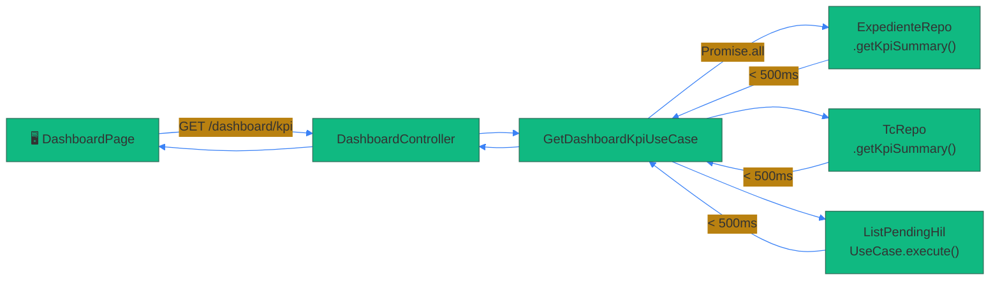

# Skill: prs-pro

## When to Use

Activate this skill whenever the user mentions:
- Creating or editing a PR description
- Documenting a pull request with diagrams or detail
- "PR bien documentada", "edita la PR", "documenta la PR"
- "PR con diagramas", "PR completa", "PR pro", "prs-pro"
- Any variation of "haz la PR", "abre un pull request", "update the PR body"

---

## Philosophy: PRs Are Living Architecture Docs

A PR description is NOT a commit message. It's a **living technical document** that:
- Tells the FULL story of WHY these changes were made
- Gives a reviewer zero-context-needed understanding
- Documents the before/after state for future reference
- Shows the architectural impact of every decision
- Provides a concrete, actionable test plan

Anyone reading the PR 6 months from now should understand the reasoning without the chat history.

---

## Non-Negotiable Rules

1. **ALWAYS read the full diff first** — `git diff base...HEAD`, `git log --oneline`
2. **ALWAYS include at least 3 Mermaid diagrams** with colorful `%%{init}%%` themes
3. **ALWAYS include emojis** in every section header
4. **ALWAYS explain the WHY** — not just what changed, but why that decision was made
5. **ALWAYS document before/after state** for complex changes
6. **ALWAYS include a commit-by-commit breakdown** when there are multiple commits
7. **ALWAYS write the PR body via HEREDOC** to preserve Mermaid + formatting
8. **ALWAYS include a matrix of changed files** with role/impact
9. **NEVER create a bare PR** with just a bullet list — that's not documentation
10. **NEVER guess intent** — read the code, understand it, then explain it
11. **ALWAYS close the related issues** with `Closes #N` at the bottom

---

## Mermaid Diagram Requirements

### Every PR MUST include diagrams from these categories:

| Type | When to Use | Mermaid Type |
|------|-------------|--------------|
| **Architecture overview** | Always for new modules/features | `flowchart TD` or `flowchart LR` |
| **Data flow** | When request/response chain changes | `sequenceDiagram` |
| **Before/After** | When refactoring existing behavior | Two `flowchart` side by side in same diagram |
| **State machine** | When states/transitions involved | `stateDiagram-v2` |
| **Module dependency** | For new modules | `flowchart LR` with subgraphs per layer |
| **Decision tree** | For guard/auth/routing logic | `flowchart TD` |
| **Timeline/Gantt** | For parallel/sequential operations | `gantt` |
| **ER / Data model** | For new DB tables or schema changes | `erDiagram` |

### Mermaid Styling Rules (MANDATORY — same as issue-creation-pro)

Every diagram MUST use custom theming via `%%{init}%%`:

```
%%{init: {'theme': 'base', 'themeVariables': {
  'primaryColor': '#COLOR',
  'primaryTextColor': '#COLOR',
  'primaryBorderColor': '#COLOR',
  'lineColor': '#COLOR',
  'secondaryColor': '#COLOR',
  'tertiaryColor': '#COLOR'
}}}%%
```

Use DIFFERENT color palettes per diagram:

| Palette | Primary | Secondary | Line | Use For |
|---------|---------|-----------|------|---------|
| Ocean | `#0ea5e9` | `#f43f5e` | `#a855f7` | Data flow, architecture |
| Sunset | `#f59e0b` | `#8b5cf6` | `#ec4899` | Root cause, decisions |
| Forest | `#10b981` | `#3b82f6` | `#f97316` | Happy path, new features |
| Royal | `#7c3aed` | `#06b6d4` | `#f59e0b` | Module maps, dependencies |
| Indigo | `#6366f1` | `#14b8a6` | `#f43f5e` | Sequences, timelines |
| Cherry | `#e11d48` | `#8b5cf6` | `#22c55e` | Error flows, bugs fixed |

---

## PR Description Structure

### Full Template

```markdown
## 🧨 Contexto y motivación

[1-2 párrafos. ¿Por qué existe este PR? ¿Qué problema resuelve o qué feature añade?
Cero contexto previo requerido — cualquier ingeniero debe entenderlo de aquí.]

---

## 📦 Bloque N — [Nombre descriptivo del bloque de cambios]

### 🔍 ¿Qué había antes / What was the state before?

[Describe the BEFORE state — what was missing, broken, or not implemented.
Use a code snippet, table, or bullet list as appropriate.]

### ✅ ¿Qué cambia / What changes?

[Describe the AFTER state in plain language. What works now that didn't before?]

### ⚙️ ¿Por qué esta decisión?

[The reasoning. If there were alternatives, mention why this approach was chosen.]

```mermaid
[Diagram showing the change — architecture, data flow, or before/after]
```

[Repeat Bloque section for each independent group of changes]

---

## 🏗️ Visión arquitectónica de los cambios

[High-level diagram showing how all the changed pieces fit together.
Module graph, layer diagram, or system integration view.]

```mermaid
[Full architecture / module dependency diagram]
```

---

## 🔄 Flujo end-to-end

[Sequence diagram showing the full request-response chain from edge to DB,
highlighting which layers were changed.]

```mermaid
sequenceDiagram
    ...
```

---

## 📊 Matriz de cambios por fichero

| Fichero | Capa | Tipo de cambio | Impacto |
|---------|------|----------------|---------|
| `path/to/file.ts` | Domain / Application / Infra / Presentation / Frontend | New / Modified / Fixed | Brief description |

---

## 📝 Historial de commits

| Commit | Tipo | Descripción |
|--------|------|-------------|
| `abc1234` | feat | Nuevo módulo dashboard — backend |
| `def5678` | fix | Corrección seed script |

---

## ✅ Plan de testing

- [ ] Test unitario / e2e: descripción exacta de qué comprobar
- [ ] Curl / endpoint test: comandos concretos
- [ ] Verificación frontend: ruta, acción, resultado esperado
- [ ] Regresión: qué módulos no deben haber roto

---

## 🚀 Issues cerrados

Closes #N
Closes #M

---

🤖 Generated with [Claude Code](https://claude.com/claude-code)
```

---

## Workflow Step-by-Step

### 1. Read everything first

```bash
git log --oneline [base]..HEAD        # all commits in this PR
git diff [base]...HEAD --stat         # files changed
git diff [base]...HEAD                # full diff
```

### 2. Group changes into logical blocks

Don't describe files — describe **concerns**:
- "Bloque A — Nuevo módulo DashboardModule (backend)"
- "Bloque B — Migración NotificationsButton a TanStack Query (frontend)"
- "Bloque C — Seed script idempotente + URL sync bandeja"

### 3. Build diagrams before writing prose

Start with the architecture/flow diagram. The prose is just narration around the diagrams.

### 4. Write the body via HEREDOC

```bash
gh pr edit <number> --repo "OWNER/REPO" --body "$(cat <<'PR_EOF'
[FULL PR BODY]
PR_EOF
)"
```

Or for creation:
```bash
gh pr create --title "feat(scope): title" --body "$(cat <<'PR_EOF'
[FULL PR BODY]
PR_EOF
)"
```

### 5. Verify the PR renders correctly

```bash
gh pr view <number> --repo "OWNER/REPO"
```

---

## Quality Checklist

Before finalizing any PR description:

- [ ] Read full diff — no assumption about what changed
- [ ] At least 3 Mermaid diagrams with different color palettes
- [ ] All diagrams use `%%{init}%%` custom theming
- [ ] Each logical block has its own section with WHY
- [ ] Architecture overview diagram covers all changed modules
- [ ] End-to-end sequence diagram for any API changes
- [ ] File matrix table with layer + impact columns
- [ ] Commit history table
- [ ] Concrete test plan (commands/actions, not vague items)
- [ ] `Closes #N` for all related issues
- [ ] PR is self-contained — reviewer needs zero prior context

---

## Anti-Patterns

- ❌ Bullet list of files changed without explanation
- ❌ "Added X, fixed Y, updated Z" with no WHY
- ❌ Mermaid diagrams without `%%{init}%%` theming
- ❌ All diagrams using the same color palette
- ❌ Missing the before/after comparison for refactors
- ❌ Vague test plan ("check that it works")
- ❌ Missing issues closed at the bottom
- ❌ Using `--body` inline for complex descriptions (use HEREDOC)
- ❌ Single-paragraph descriptions for multi-module PRs
- ❌ No file matrix — reviewer doesn't know what to focus on

---

## Examples of Good vs Bad Sections

### ❌ Bad

```markdown
## Changes
- Added dashboard module
- Fixed seed script
- URL sync in bandeja
```

### ✅ Good

```markdown
## 🏗️ Bloque A — Nuevo módulo `DashboardModule` (backend)

### 🔍 ¿Qué había antes?
El frontend realizaba N llamadas paralelas a distintos endpoints para construir la vista del dashboard, aumentando la latencia y complejidad del cliente.

### ✅ ¿Qué cambia?
Un único `GET /api/internal/dashboard/kpi` agrega en `Promise.all` las queries de expedientes, consultas técnicas y validaciones HIL pendientes. Tiempo de respuesta < 500ms.

### ⚙️ ¿Por qué esta decisión?
Se eligió aggregation en backend en lugar de N fetches en cliente porque:
1. Reduce latencia total (paralelo en backend > paralelo en cliente con JWT overhead)
2. Centraliza la lógica de tenant isolation
3. Simplifica el frontend a una sola query


```
