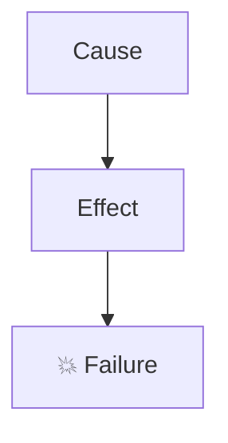

## When to Use

- User asks to create a PR from current changes (any phrasing)
- User says "haz una PR", "create a pull request", "open a PR"
- User says "explica la PR", "PR completa", "PR con diagramas", "PR bien documentada"
- User asks to commit AND create a PR in one shot

## Critical Patterns

### 1. Always read before writing

BEFORE creating the PR, gather full context:

```bash
git status                         # which files changed
git diff                           # what exactly changed
git log --oneline -5               # recent history for branch naming
git diff [base]...HEAD             # if already on a feature branch
```

Do NOT create the PR until you understand WHY each change exists.

### 2. Branch naming

```
fix/{short-slug}          # bug fixes
feat/{short-slug}         # new features
refactor/{short-slug}     # refactors
chore/{short-slug}        # tooling, deps, config
docs/{short-slug}         # docs only
```

### 3. Commit message (Conventional Commits)

```
<type>(<scope>): <short imperative summary>

- Bullet explaining change 1
- Bullet explaining change 2
- Bullet explaining change 3
```

Never add "Co-Authored-By" or AI attribution.

### 4. PR description structure (MANDATORY)

Every PR description MUST follow this exact structure:

```markdown
## 🧨 Resumen del problema
[One paragraph max. What was broken or missing, in plain language.]

---

## 🔍 Bug/Feature N — [Title]

### ¿Qué pasaba? / What was happening?
[Describe the symptom — error message, wrong behavior, etc.]

### ¿Por qué? / Why?
[Root cause. Use a Mermaid diagram when the flow is non-trivial.]



### ✅ Fix / Implementation
[What was changed and why it fixes the issue. Code snippet if helpful.]

[Repeat for each independent bug/feature]

---

## 📦 Cambios adicionales / Additional changes
[Bullet list of minor changes: deps added, types fixed, config tweaks]

---

## ✅ Test plan
- [ ] Item 1
- [ ] Item 2
- [ ] Item 3

---

🤖 Generated with [Claude Code](https://claude.com/claude-code)
```

### 5. Mermaid diagrams — when and how

Use a Mermaid diagram when:
- A data flow is involved (request → service → DB → response)
- A bug is caused by a chain of effects (A breaks B which breaks C)
- A before/after comparison helps understanding
- A decision tree exists (if X then Y else Z)

Prefer `flowchart TD` for chains, `flowchart LR` for data structures/mappings.

Always label nodes with plain language inside quotes. Use emojis in node labels (💥 ✅ ❌) to highlight outcome nodes.

### 6. Comparison tables

Use tables when comparing options/approaches:

```markdown
| | Option A | Option B |
|---|---|---|
| Feature | ❌ No | ✅ Yes |
| Speed | Fast | Slow |
```

### 7. Files to NEVER include in the PR

- `.env`, `.env.*` — environment files
- `*.log` — log files  
- `storage/` — local file storage
- `.cursor/`, `.vscode/` — editor config
- Any file containing secrets or credentials
- Large binary files unless specifically requested

Always stage files explicitly by name, never `git add .` or `git add -A`.

## Workflow (step by step)

```
1. git status          → identify changed files
2. git diff            → understand each change
3. Reason about WHY   → what broke? what's the fix?
4. git checkout -b     → create branch
5. git add <files>     → stage ONLY relevant files
6. git commit -m       → conventional commit
7. git push -u origin  → push branch
8. gh pr create        → create PR with full description
9. Return PR URL       → show user
```

## Commands

```bash
# Read changes
git status
git diff
git diff HEAD~1

# Create branch
git checkout -b fix/my-fix

# Stage specific files (NEVER git add .)
git add path/to/file1.ts path/to/file2.ts

# Commit
git commit -m "fix(scope): short summary"

# Push
git push -u origin fix/my-fix

# Create PR (use HEREDOC for body)
gh pr create --title "fix(scope): title" --body "$(cat <<'EOF'
[PR body here]
EOF
)"
```

## PR Title format

```
<emoji> <type>(<scope>): <imperative summary>
```

Examples:
- `fix(dev): replace tsx with tsc-watch to restore NestJS DI`
- `feat(exports): add XLSX synchronous generation`
- `chore(deps): upgrade TypeORM to 0.3.28`

Keep titles under 72 characters.

## Resources

- **Example PR**: See the PR that created this skill for a reference implementation
